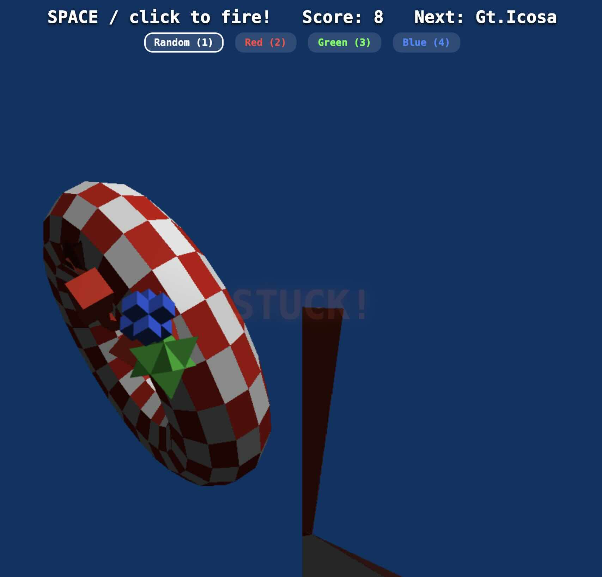
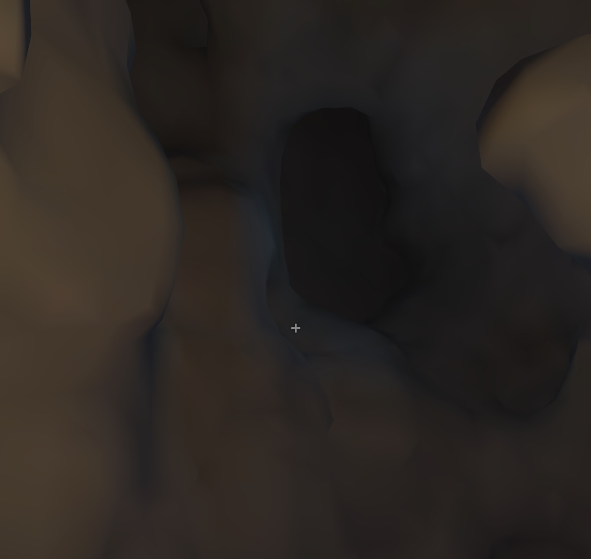
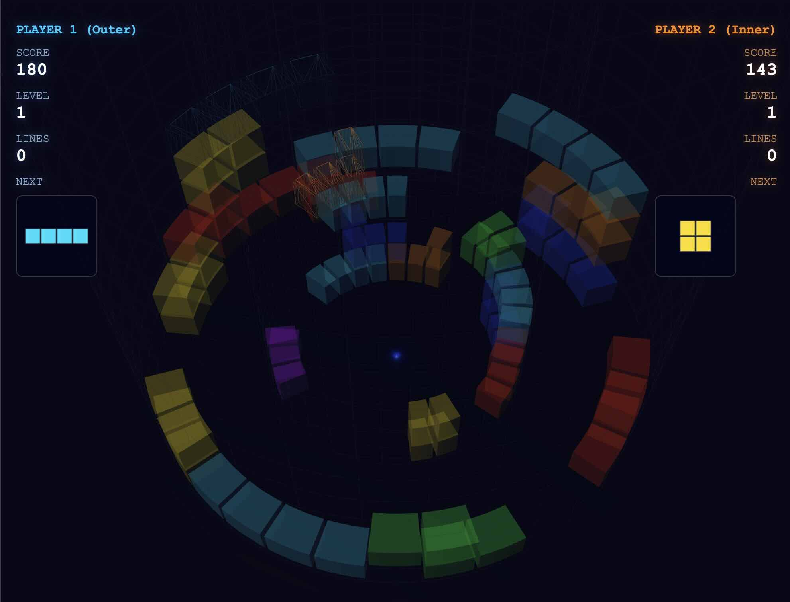
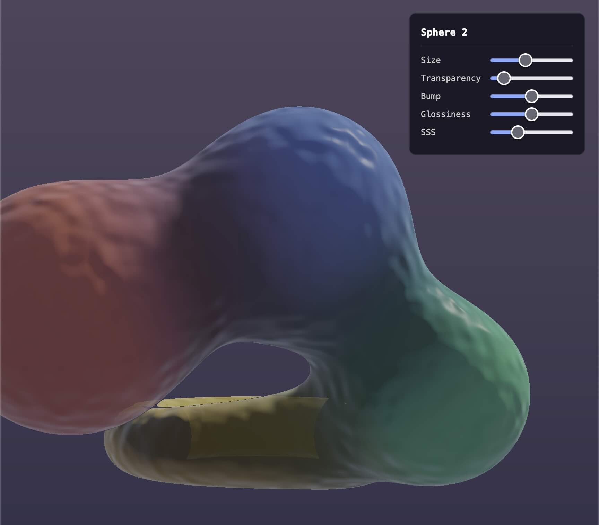
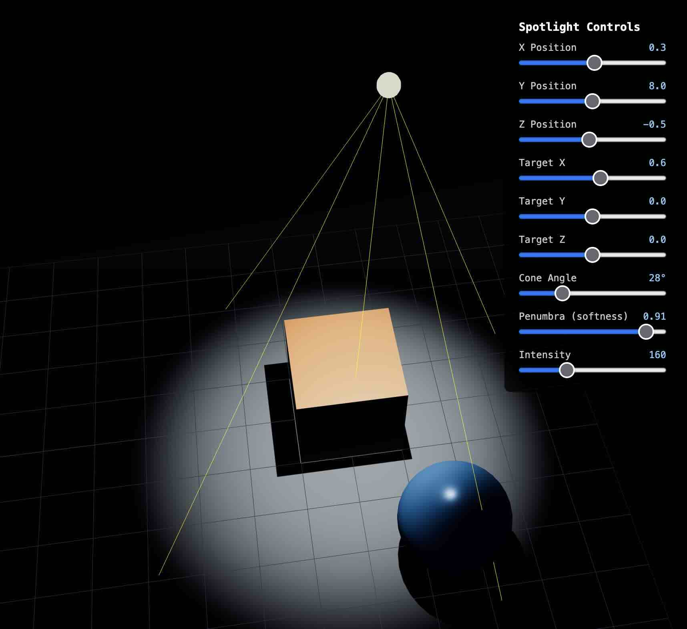
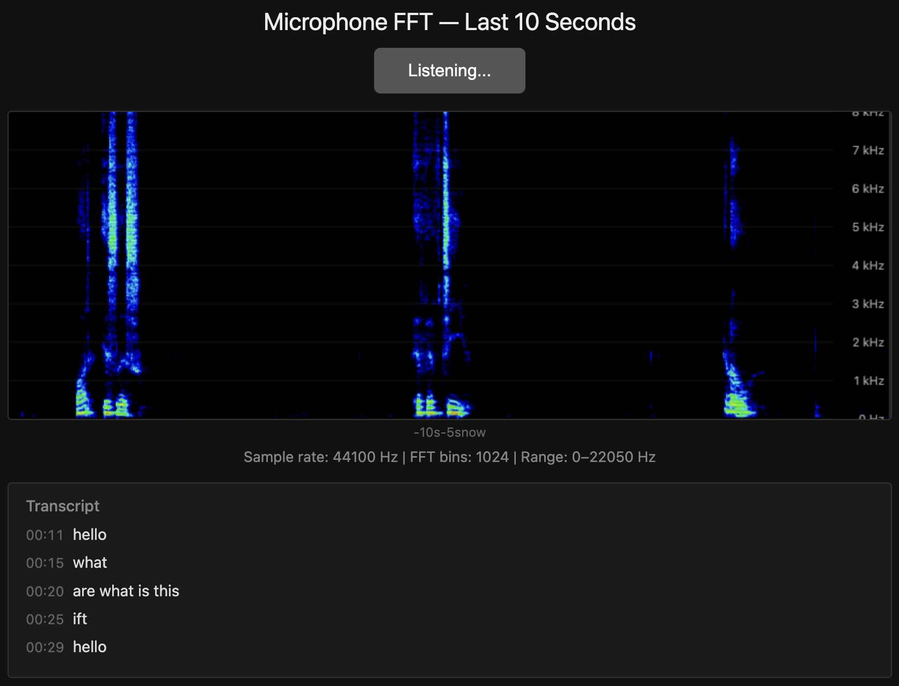
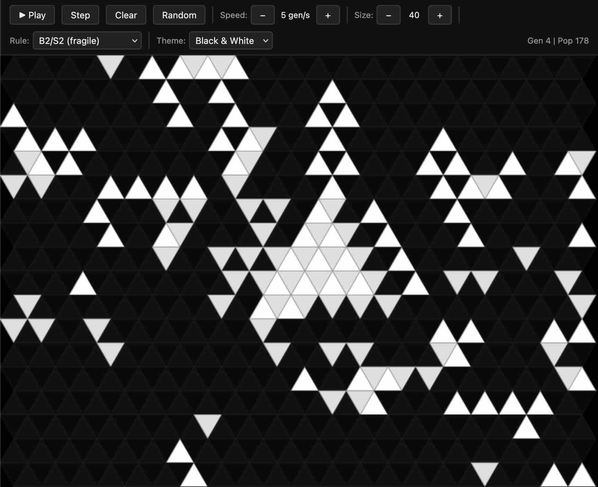
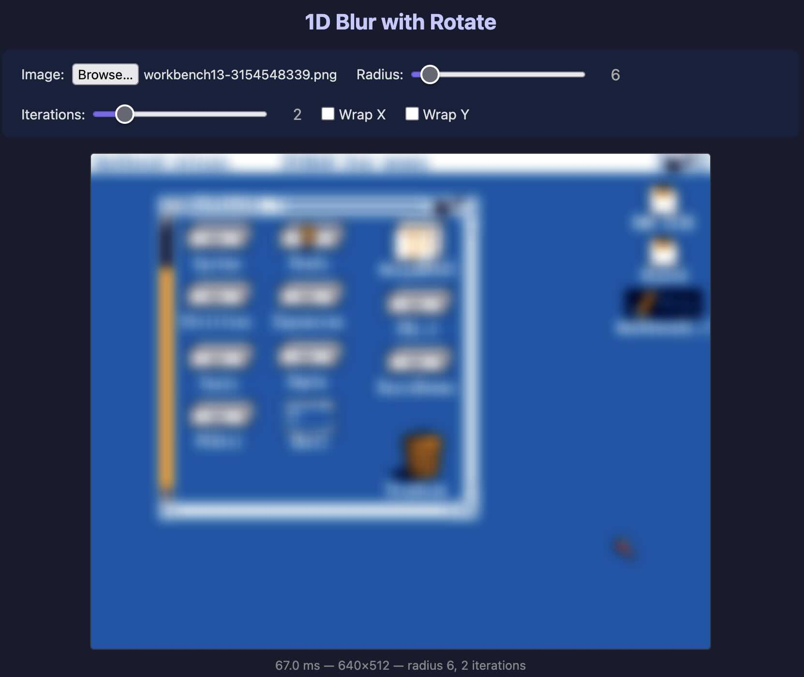

# Vibe Coding Lab

A collection of browser-based experiments. Unfinished, undocumented, weird stuff. Each experiment is a self-contained HTML file -- just open it in a browser, no build step needed.

## Experiments

### 3D Torus Shooter

Shoot geometric shapes into a torus. Shapes can stick, bounce, or carve holes through it. Split-screen with an exterior view and a first-person interior view. Custom WebGL ray marching with CSG operations.

### 3D Voxel Cave

Procedurally generated voxel cave using Perlin noise. Walk around in first person and carve into the walls. Real-time mesh reconstruction with Surface Nets.

### 3D Tetris Cylinder (2-Player)

Two-player Tetris on concentric cylinders. One player on the outer ring, one on the inner. Three.js.

### 3D Meta Balls

Interactive metaballs rendered with ray marching and signed distance functions. Adjustable materials: transparency, bump mapping, glossiness, subsurface scattering. WebGL.

### 3D Shadows

Spotlight with soft shadows. Adjustable position, angle, penumbra, intensity. Three.js.

### Audio FFT Transcribe

Real-time spectrogram of microphone input (last 10 seconds) with live speech-to-text via the Web Speech API.

### 2D Triangle Game of Life

Conway's Game of Life on a triangular grid. Multiple rule sets and color themes.

### 2D Blur

Image blur using a 1D blur-with-rotate technique. Upload an image, tweak radius and iterations.

## License

MIT
