# Vibe Coding Lab

A collection of browser-based experiments. Unfinished, undocumented, weird stuff. Each experiment is a self-contained HTML file -- just open it in a browser, no build step needed.

Browse the gallery at [index.html](index.html), or jump straight to the highlights below. The [full list](#all-experiments) is further down.

## Highlights

### A Real Stab at the Riemann Hypothesis

A browser laboratory that builds the zeta function from scratch in double precision, hunts zeros of Hardy's Z(t) live, audits them Turing-style, plays the primes against the zeros through Weil's explicit formula, and dissects the machinery of the 2026 "two thirds of zeros are simple and on the line" result. The engine self-tests on the page before it computes anything, and since September 2026 the page also runs Lamzouri's matrix-free second proof of the same constants against its own zeros. The `dev/` folder holds the numerical research program behind it, with interval-arithmetic checkers and a research note that is honest about what is proven and what is only observed.

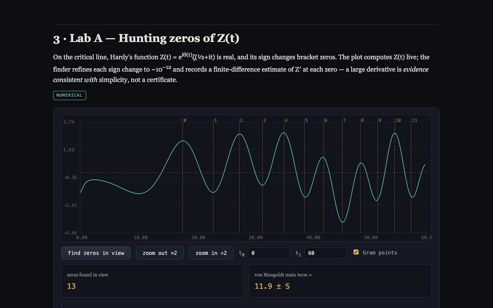

### Atlas of Computational Building Blocks

A single-page reference atlas of 263 computational ideas across algorithms, data structures, systems, cryptography, ML, optimization, robotics, databases, geometry and compression. Each entry carries prerequisites, invariants and failure modes; the whole thing is filterable like a periodic table, and an audit script keeps the dataset consistent.

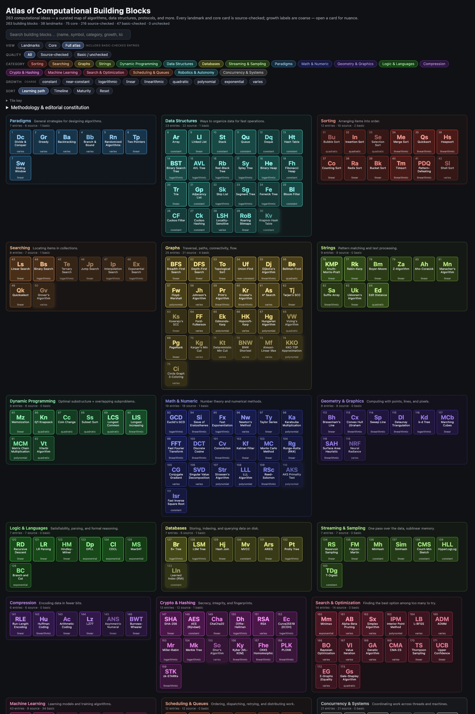

### Forward-Forward Binary Language Model

Hinton's Forward-Forward algorithm training a byte, bigram or trigram next-token model in the browser. No backprop, no GPU. Train, pause, sample from the current weights, resume. Muon, Adam and SGD optimizers to compare.

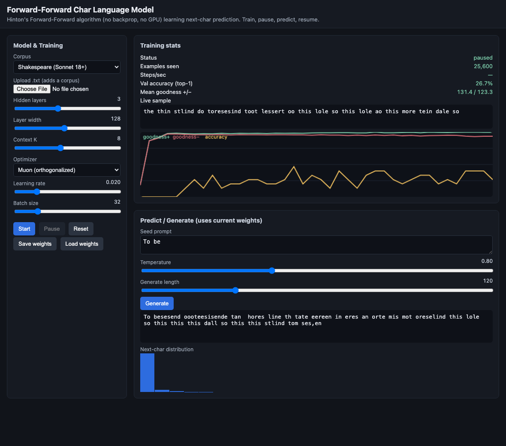

### Negative-Weight Shortest Paths in Near-Linear Time

A step-by-step visualisation of the Bernstein, Nanongkai and Wulff-Nilsen 2022 algorithm for single-source shortest paths with negative edge weights. Watch the low-diameter decomposition, the price functions and the recursion unfold on an SVG graph.

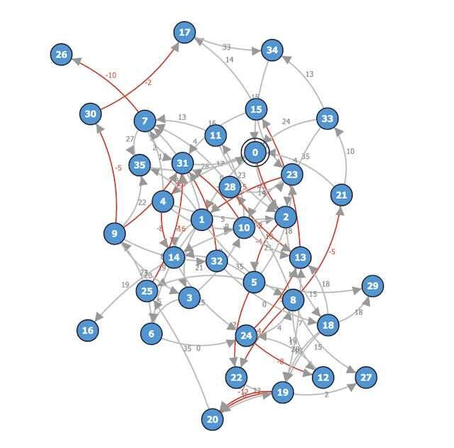

### 3D Torus Shooter

Amiga-demo-style two-player shooter on a torus. Shots stick, bounce or carve holes clean through the surface. Split-screen with an exterior view and a first-person interior view of the same signed-distance field. Hand-written WebGL ray marching with CSG, no engine.

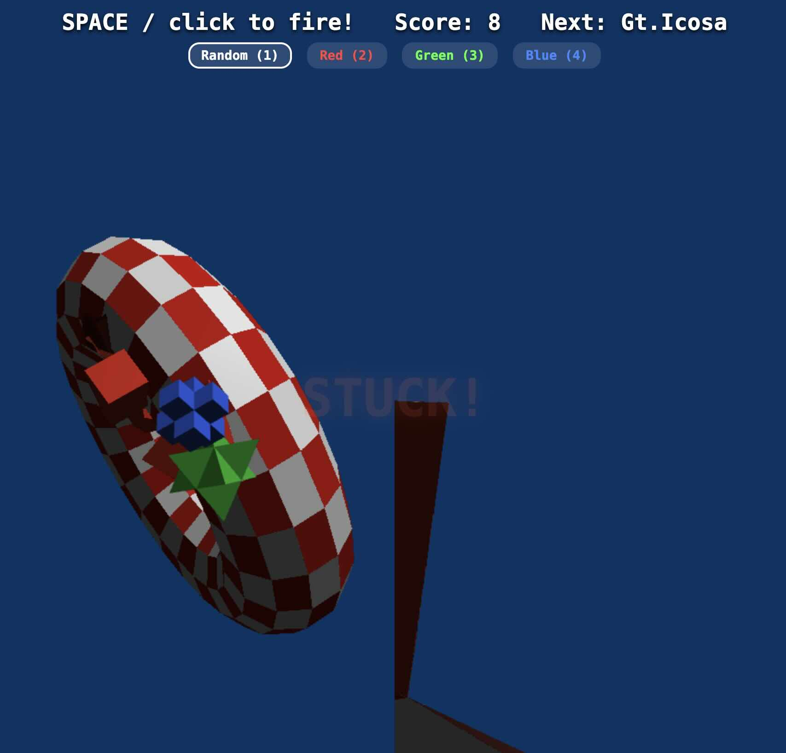

### 3D Wrecking Ball

Swing a crane-hung wrecking ball into a stone castle, a Mesoamerican pyramid, a wooden Trojan horse or a red-brick apartment block, all generated block by block. A mortar-bond model cracks blocks loose under impact and drops whatever loses its footing. Grab the ball on its chain with the mouse, drive the crane with the keys, synthesised thuds, clatter and crane motor. Three.js + Rapier.

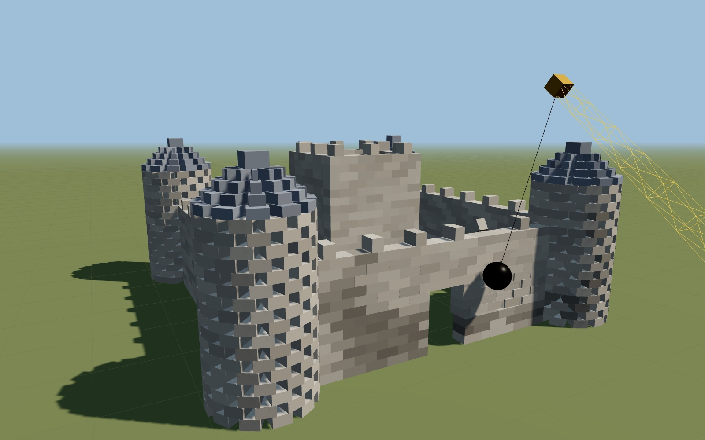

### 3D Stair Dismount

A homage to Porrasturvat's Stair Dismount. A ragdoll stands on top of a straight flight, a dogleg, a spiral or a long walled staircase. Click a spot on the body, aim the arrow, choose the force and push; every impact on the way down scores, head hits most. Retry replays the exact push. Three.js + Rapier.

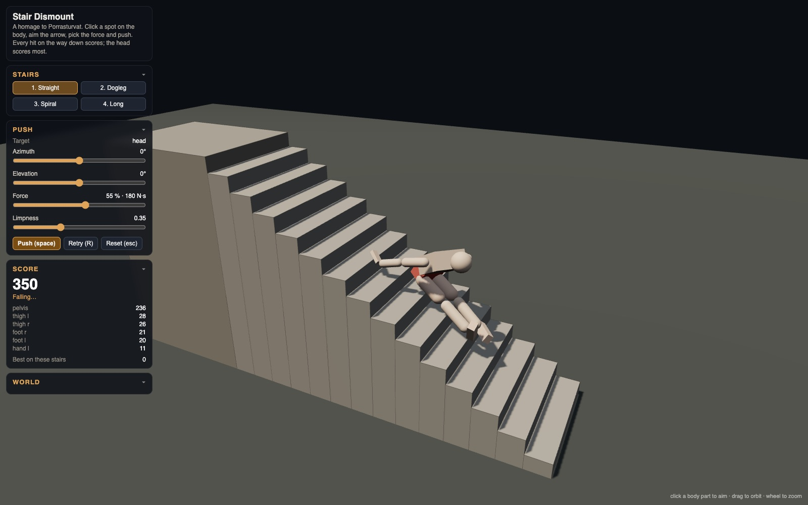

### Snake MCTS

Browser port of [SwiftSnakeEngine](https://github.com/neoneye/SwiftSnakeEngine), a two-player snake puzzle with a Monte Carlo tree search opponent running in a Web Worker. Shows the bot's planned path, supports undo, and ships a tournament harness for pitting bot configurations against each other in Node.

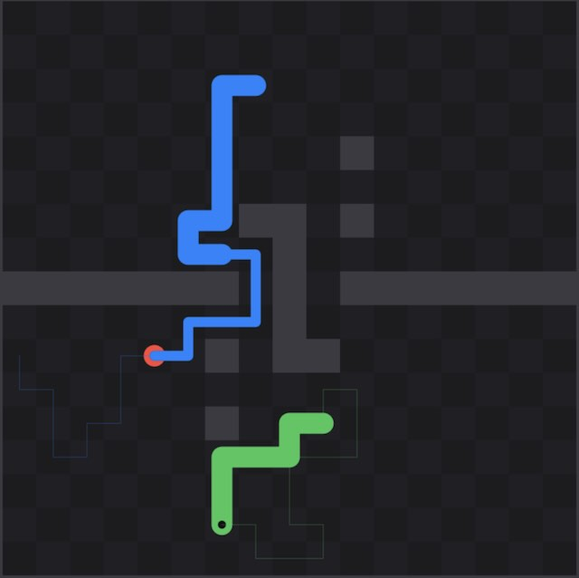

### Basement, Sublevel K

A Wolfenstein-style raycaster horror game with VHS post-processing. Every texture, sprite and sound is generated in code at load time; the single HTML file has no assets at all.

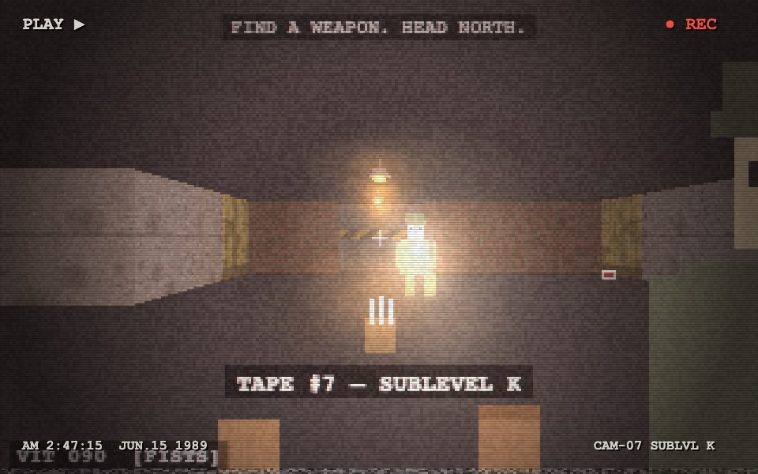

### 2D Pulleys

Drag pulleys from the tray onto the beam or the hook, or start from a ready-made rig, then haul on the rope. Computes mechanical advantage and rope pull, lets the load swing on its sling and the wind push on it, and if you hang a unicorn from the hook its jointed legs dangle, its mane trails, and its horn will eventually snap off.

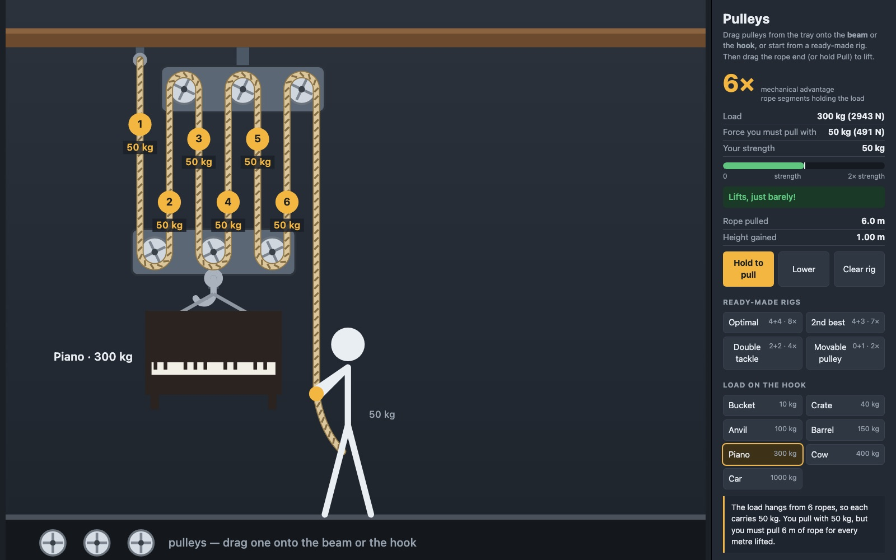

### Audio Singularity

Black holes, a bouncing ball, a spinning disk and the AI singularity are the same shape: something diverges at a finite time. This page makes that shape audible as chirps and event swarms, with plots to match and WAV export. Web Audio.

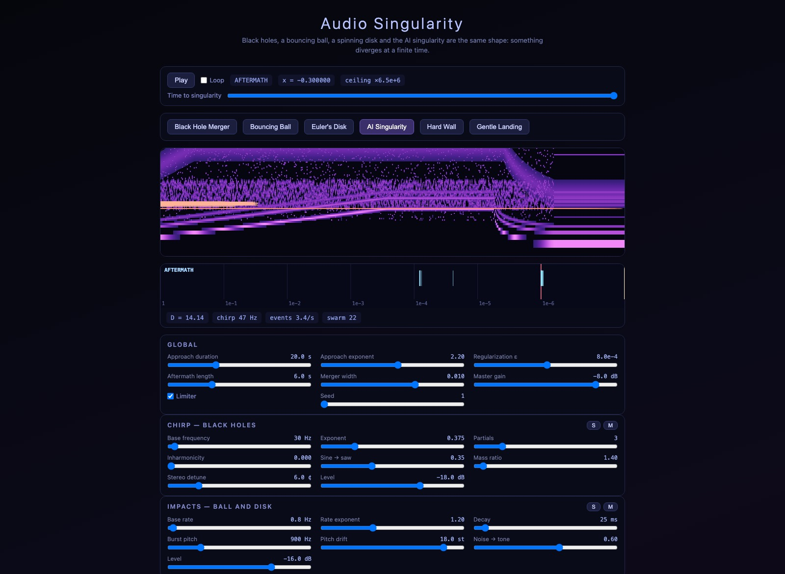

### 1927 Solvay Conference

The famous group photo with a clickable circle over each of the 29 attendees, linking to their Wikipedia pages. Face positions were found offline with OpenCV's YuNet detector.

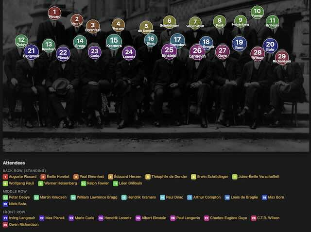

### The Pythagorean Cup

The greedy cup, cut open and explained. A guided tour, a pressure view along the siphon path, and free-play pouring on top of a small one-dimensional hydraulics model. SVG.

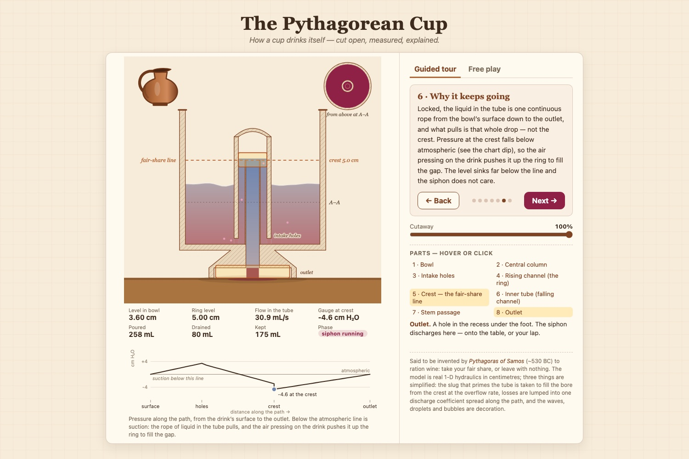

### Spinor Belt Trick

Dirac's belt trick: a 360 degree turn leaves a twist, 720 degrees undoes it. A scrubbable quaternion homotopy shows why. Three.js.

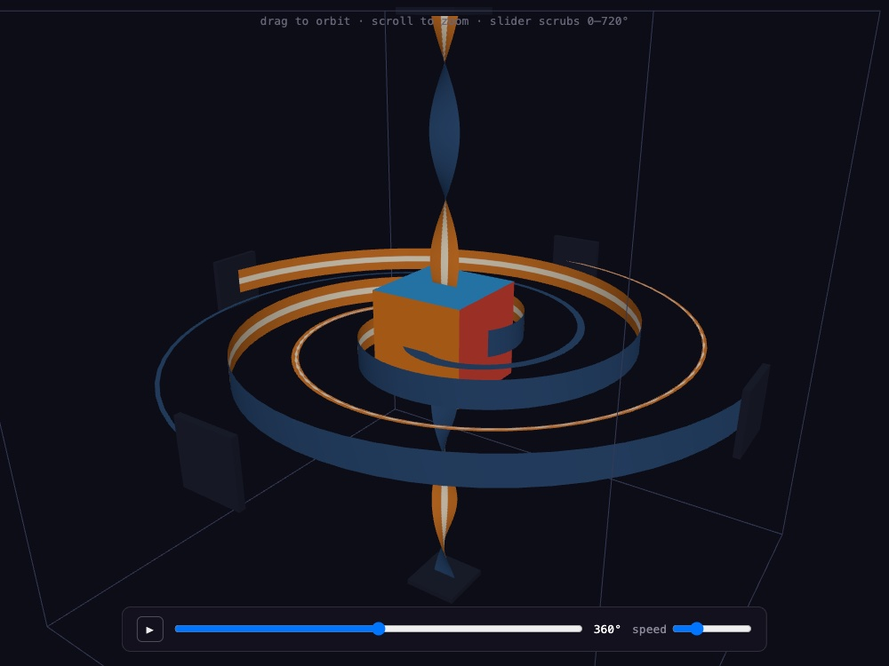

## All experiments

### 2D simulations and visualisations

- [2d-blur](2d-blur/) -- image blur by repeated 1D box blurs at rotated angles; upload an image, tweak radius and iterations.
- [2d-city-generator](2d-city-generator/) -- Substrate-style city plans grown by crawling agents that crack and branch at right angles.
- [2d-cloud-chamber](2d-cloud-chamber/) -- alpha, beta and muon condensation trails with an adjustable magnetic field.
- [2d-dual-slit-experiment](2d-dual-slit-experiment/) -- one to three slits, a which-path detector and particle-by-particle accumulation, computed from Huygens wavelets.
- [2d-fluid-simulation](2d-fluid-simulation/) -- particle fluid via double-density relaxation SPH, with draggable obstacles and stirring.
- [2d-ifs-fractals](2d-ifs-fractals/) -- IFS and flame fractals that crossfade between systems into a histogram image.
- [2d-ion-wind-aircraft](2d-ion-wind-aircraft/) -- explainer and simulation of electroaerodynamic propulsion, from the MIT glider to a hovering drone.
- [2d-monte-carlo-pi](2d-monte-carlo-pi/) -- estimate pi by throwing points at inscribed shapes, with a convergence plot.
- [2d-pendulum](2d-pendulum/) -- double and triple pendulum with trails, sonified through Web Audio with a spectrogram.
- [2d-perlin-noise](2d-perlin-noise/) -- seamlessly tiling noise with fixed-point Perlin and simplex backends, octaves and shaping modes.
- [2d-pulleys](2d-pulleys/) -- see highlights.
- [2d-shortest-path](2d-shortest-path/) -- see highlights.
- [2d-skin-texture](2d-skin-texture/) -- procedural tiling skin with veins, freckles, pores, vitiligo and bump-mapped lighting.
- [2d-slime-mold](2d-slime-mold/) -- Physarum agents with pheromone deposit, diffusion and decay; click to drop food.
- [2d-solvey-conference](2d-solvey-conference/) -- see highlights.
- [2d-speed-of-light](2d-speed-of-light/) -- relativity of simultaneity with an animated scene and a Minkowski diagram driven by an observer-velocity slider.
- [2d-tesla-valve](2d-tesla-valve/) -- forward and reverse flow through a Tesla valve side by side, with a live flow ratio, on a lattice-Boltzmann solver.
- [2d-triangle-game-of-life](2d-triangle-game-of-life/) -- Conway's Game of Life on a triangular grid with selectable rules and themes.

### 3D

- [3d-eiffel-tower-assembly](3d-eiffel-tower-assembly/) -- scrub the 1887 to 1889 timeline and watch the tower rise, with falsework, creeper cranes and weather. Three.js.
- [3d-game-basement](3d-game-basement/) -- see highlights.
- [3d-geo-guess](3d-geo-guess/) -- country-guessing on a draggable orthographic globe built from embedded polygon data, projected by hand on a canvas.
- [3d-meta-balls](3d-meta-balls/) -- metaballs raymarched from signed distance fields with transparency, bump, gloss and subsurface controls. WebGL.
- [3d-shadows](3d-shadows/) -- a spotlight with soft shadows; adjust position, cone, penumbra and intensity. Three.js.
- [3d-spinor-belt-trick](3d-spinor-belt-trick/) -- see highlights.
- [3d-stair-dismount](3d-stair-dismount/) -- see highlights.
- [3d-tetris-cylinder-2player-game](3d-tetris-cylinder-2player-game/) -- two-player Tetris on concentric cylinders, one keyboard. Three.js.
- [3d-torus-shooter](3d-torus-shooter/) -- see highlights.
- [3d-voxel-cave](3d-voxel-cave/) -- first-person Perlin-noise cave you can carve into, remeshed live with Surface Nets. Three.js.
- [3d-wrecking-ball](3d-wrecking-ball/) -- see highlights.
- [simulate-hand](simulate-hand/) -- a 27-degree-of-freedom hand grasping spheres, cubes and pencils with contact and grip-force readouts. Three.js.

### Audio

- [audio-bird-synth](audio-bird-synth/) -- birdsong synthesizer with species presets, mutating phrases and call-and-response.
- [audio-cat-synth](audio-cat-synth/) -- two synthesized cats argue in hisses, growls, yowls and spits.
- [audio-fft-transcribe](audio-fft-transcribe/) -- live microphone spectrogram of the last 10 seconds with speech-to-text from the Web Speech API.
- [audio-singularity](audio-singularity/) -- see highlights.
- [audio-text-to-speech-amiga](audio-text-to-speech-amiga/) -- a recreation of the Amiga "Say" formant synthesizer with speed, pitch, mouth and throat knobs.

### Games

- [game-acronym-sorter](game-acronym-sorter/) -- sort acronyms into categories, C64 palette and soundtrack.
- [game-ball-puzzle](game-ball-puzzle/) -- tilt a maze to roll a ball home. Three.js.
- [game-boulder-dash](game-boulder-dash/) -- Colosseum Dash: a Boulder Dash clone where a gladiator digs the arena sand for gold past lions and elephants.
- [game-burger-assembly](game-burger-assembly/) -- C64-style burger stacking at 320x200.
- [game-carrier-shadow](game-carrier-shadow/) -- Minesweeper deduction meets Battleship with moving ships and an air layer; escort tankers through Hormuz.
- [game-moat](game-moat/) -- MOAT: keep twelve crocodiles alive and everybody else out. Heaters, feeding, staff.
- [game-schorched-earth](game-schorched-earth/) -- turn-based artillery in the spirit of Scorched Earth, hotseat or against the AI.
- [game-scifi-rpg](game-scifi-rpg/) -- a stick-figure sci-fi RPG with inventory and quests.
- [game-snake](game-snake/) -- see highlights.
- [game-straight-up-the-hormuz](game-straight-up-the-hormuz/) -- Minesweeper crossed with Battleship on an oil budget; every shot costs, deduction saves.

### Tools, explainers and the rest

- [camera-face-manipulator](camera-face-manipulator/) -- webcam face remixer that swaps, mirrors and time-lags eyes, nose and mouth using MediaPipe landmarks.
- [cartoon-face](cartoon-face/) -- cartoon face studio with 60 expression presets and fine sliders, drawn as parameterised SVG.
- [dag-lab](dag-lab/) -- a Werkkzeug-style DAG editor where nodes connect by adjacency on a grid instead of wires.
- [datetime-converter](datetime-converter/) -- multi-zone time comparison grid with pinning, drag reordering and day/night tinting.
- [datetime-week-number](datetime-week-number/) -- a year calendar with ISO 8601 week numbers.
- [dmidi-survey](dmidi-survey/) -- a self-administered battery of judgment-and-decision-making and personality scales with scoring and export; nothing leaves the browser.
- [education-computational-building-blocks](education-computational-building-blocks/) -- see highlights.
- [forward-forward](forward-forward/) -- see highlights.
- [markdown-in-html](markdown-in-html/) -- a page that renders its own inline Markdown source.
- [packing](packing/) -- square packing solver that squeezes rotated unit squares into a container by resolving overlaps.
- [pythagorean-cup](pythagorean-cup/) -- see highlights.
- [riemann-stab](riemann-stab/) -- see highlights.
- [text-diff](text-diff/) -- side-by-side and unified diff with a line-level Myers implementation.
- [text-ngram](text-ngram/) -- n-gram frequency analysis of dropped text files with many tokenization modes.

## License

MIT
