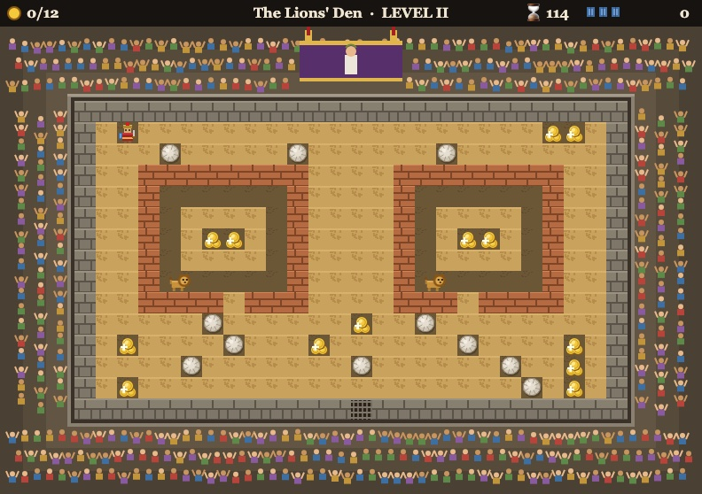

# Colosseum Dash

A Boulder Dash-inspired top-down 2D game set in the Roman Colosseum. You are
a gladiator digging through the arena sand, gathering gold while the crowd
roars from the stands and the emperor watches from his box. Single
self-contained `index.html`; open it directly from disk, no server or build
step needed.

## How it maps to Boulder Dash

| Boulder Dash | Colosseum Dash |
| --- | --- |
| Rockford | Gladiator |
| Dirt | Arena sand |
| Boulders | Stone column drums (fall, roll, crush) |
| Diamonds | Gold |
| Fireflies | Lions — hug the left wall, deadly to touch |
| Butterflies | Elephants — hug the right wall, burst into a 3×3 of gold when crushed |
| Exit | Portcullis gate, opens at the gold quota |

The engine is a classic deterministic cell simulation: one top-to-bottom,
left-to-right scan per tick, falling/rolling physics, 3×3 explosions. The
audience in the stands is reactive — every gold pickup draws scattered
applause and a swell of crowd roar (a looping WebAudio noise bed that follows
the excitement level), and explosions and victories bring the house down.
Caesar watches from his box with Cleopatra at his side, attended by servant
girls — two sway palm fans over the royals, one bears a tray with a gold jug.
On a win Caesar salutes you with a wave and a thumbs-up and Cleopatra raises
a hand with him; when you fall he lifts his chin, puts a hand on his hip, and
gives a slow, dismissive thumbs-down while the crowd howls. The death screen
zooms in on the grinning imperial party above a pixel-art tableau of the
fallen gladiator, helmet rolled away in the sand, while arena rats scurry
in to help themselves.

The Colosseum itself is framed in Roman architecture: a marble colonnade
rings the stands beneath a slanted terracotta portico roof, and the imperial
box is a proper temple front with fluted columns and a pediment.

## Levels

1. **Training Grounds** — sand, stones, and gold; learn the physics.
2. **The Lions' Den** — two lion pits sealed by sand; raid them or crack them open.
3. **Elephant March** — not enough gold on the map; drop stones through the
   gaps in the pen to crush elephants for their gold.
4. **The Emperor's Games** — lions, a penned elephant, and a tight timer.

## Controls

| Key | Action |
| --- | --- |
| Arrow keys / WASD | Move / dig / push stones |
| Enter | Start / next |
| R | Retreat (restart level, costs a life) |
| P | Pause |
| M | Mute |
| F | Fullscreen (Esc leaves) |

## Development

The game engine lives in the `shared-code` script block of `index.html` and
is fully deterministic (no RNG, no DOM). `node test.mjs` extracts and runs
the embedded test suite: physics, beast AI golden paths, explosion
semantics, a scripted full walkthrough of level 1, and map validity/stability
checks for all shipped levels.

Design spec: `docs/superpowers/specs/2026-07-15-colosseum-boulder-dash-design.md`.
