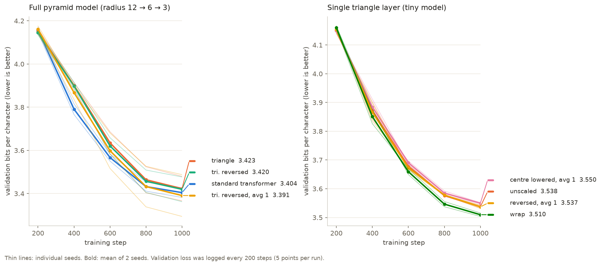

# shape-llm

Small character-level language models whose structure follows a shape.

## The hexagonal pyramid

The hidden state, for every token, is a **hexagon of feature cells**,
shrinking through the network like an image pyramid:

| blocks | hexagon radius | cells | channels per cell | features |
|---|---|---|---|---|
| 1–2 | 12 | 469 | 2 | 938 |
| 3–4 | 6 | 127 | 6 | 762 |
| 5–6 | 3 | 37 | 16 | 592 |

* **Each block:** causal self-attention across tokens on the flattened hexagon (4 heads, 128-dim), then a **hexagonal feed-forward**. Every cell mixes with its 6 neighbours through a shared, gated 7-tap hexagonal convolution, plus a per-cell bias.
* **Bottlenecks, "3 neighbours → 1 cell":**
  - The up-triangles {b, b+(1,0), b+(0,1)}, with base points on the sublattice q − r ≡ 0 (mod 3), tile the hexagonal grid exactly. Their base points form a coarser hexagonal grid (rotated 30°, scaled √3: the aperture-3 hierarchy).
  - Each coarse cell is a learned linear map of its triangle's 3 fine cells.
  - The coarse grid is cropped to radius 6, then 3. Because the requested radii halve while the triangles shrink by √3, the crop drops the outer band of fine cells: 377 of 469 used, then 107 of 127.
* **Baseline:** an ordinary 6-layer transformer (GELU MLP) with the same parameter count.

Files:
- `hexgrid.py`: geometry and checks (`python3 hexgrid.py`);
- `shapellm.py`: models and training (`python shapellm.py hex|base seed steps`).

Data: the repository's markdown, character level.

## Results (2,000 steps, CPU, 2 seeds)

| model | parameters | val bits/char | time per step |
|---|---|---|---|
| standard transformer | 2.59M | **2.992** (2.991, 2.992) | 0.11 s |
| hex v1: shared 7-tap kernel; attention holds 89% of the parameters | 2.63M | 3.342 (3.252, 3.431) | 0.47 s |
| standard transformer, re-matched | 2.25M | **3.023** (3.031, 3.016) | 0.10 s |
| hex v2: locally connected (each cell its own neighbour weights); hexagonal part holds 52% | 2.33M | 3.259 (3.223, 3.295) | 0.48 s |

* **The hexagonal pyramid is clearly worse than a standard transformer at the same size:** 0.35 bits/char behind for v1, 0.24 for v2.
  - It also trains less consistently (the seeds differ by 0.07–0.18).
  - It is 4–5× slower per step on CPU because of the neighbour gathering.
* **v1's main handicap was its budget:** a shared hexagonal kernel has almost no parameters (40k), leaving the model mostly attention. Giving the hexagonal part its own weights per cell (v2) helps but does not close the gap.
* **Likely remaining causes**, untested:
  - mixing within a token is only local (6 neighbours per block);
  - the width shrinks with depth (938 → 762 → 592 features);
  - the cropped bottlenecks discard the outer band of cells.

### What the hexagonal structure does give: an importance order (v1, `analyze.py`)

Zeroing cells of the residual stream at the end of each level, outer rings first vs the same number of random cells (Δ bits/char, mean of 2 seeds):

| level | cells kept | outer rings first | random |
|---|---|---|---|
| radius 12 | 85% | +0.006 | +0.065 |
| radius 12 | 71% | +0.034 | +0.168 |
| radius 6 | 72% | +0.089 | +0.264 |
| radius 3 (read by the output head) | 51% | **+0.18** | **+0.32** |

* At radius 12 and 6, part of this is built in: the cropped bottleneck never reads the outermost band, so zeroing it is nearly free by construction.
* At radius 3 the output head reads every cell, yet the outer ring is still about 40% cheaper to drop than random cells, and its activations are about 35% weaker (1.14 vs 1.8).
* The centre-first importance order seen in the single-layer experiments reappears in a full model.

### Neighbour-count normalisation (`hex2n`)

Cells at the hexagon's edge have only 3–4 neighbours, so their input is weaker. Scaling every cell's neighbourhood
by √(7 / number of valid neighbours) gives each cell the same expected input (interior cells keep weight 1).

| shape-llm v2 | val bits/char (2 seeds) |
|---|---|
| without normalisation | 3.259 (3.223, 3.295) |
| with normalisation | 3.254 (3.246, 3.261) |
| standard transformer, same size | **3.023** |

A tie on quality. The normalised seeds agree more closely (spread 0.015 vs 0.072), possibly steadier training, but two seeds can't establish that.

## The triangle: weights swept at 0°, 60° and 120°

`tiny.py` (single layer in the tiny model), `tri_props.py` (its properties), and the `tri*` kinds in
`shapellm.py` (triangle feed-forwards inside the same hexagonal pyramid, same bottlenecks, same 48-dim attention
as `hex2`; triangle sides 50 / 65 / 85).

Triangle layer: h = A·x (n units), weights W on cells (i, j, k), three sweeps
y0[i] = Σ W·h_j·h_k, y1[j] = Σ W·h_i·h_k, y2[k] = Σ W·h_i·h_j, then B·[y0, y1, y2].
- **no wrap:** i + j + k = n − 1, so the line at index i holds n − i weights. Long lines are the triangle's "centre" and short lines its edge.
- **wrap:** i + j + k ≡ n − 1 (mod n), n² weights on a torus; every line holds n.
- **centre lowered (S):** each output × (products it collects)^−½, so long lines are turned down and length-1 lines keep weight 1. With wrap all lines are equal, so this is just a constant.
- **centre lowered, average kept at 1 (SN):** the same, renormalised so only the balance between lines changes, not the overall size.

The training text has grown since the earlier runs, so everything below was re-run together at 1,000 steps (2 seeds each, validation bits/char).

### Full model (hexagonal pyramid, radius 12 → 6 → 3)

| feed-forward | val bits/char |
|---|---|
| standard transformer (no pyramid) | **3.384** (3.372, 3.396) |
| **triangle, no wrap, unscaled** | **3.407** (3.421, 3.392) |
| triangle, wrap, unscaled | 3.441 (3.463, 3.419) |
| triangle, no wrap, centre lowered, average kept at 1 | 3.465 (3.472, 3.458) |
| triangle, wrap, scaled (constant) | 3.514 (3.492, 3.536) |
| triangle, no wrap, centre lowered | 3.554 (3.528, 3.580) |
| hexagonal local feed-forward (`hex2`) | 3.587 (3.541, 3.634) |

* **The triangle feed-forward rescues the pyramid.** It is 0.18 bits/char better than the hexagonal local feed-forward and within 0.02 of a standard transformer at 1,000 steps, about the seed spread. Longer runs (below) put the best triangle, the wrapped one, 0.013 behind at 4,000 steps, within seed noise.
* So the pyramid and its 3 → 1 bottlenecks were not what held the hexagonal model back. The local 7-neighbour mixing was.

### Single layer (tiny model)

| triangle layer | unscaled | centre lowered | centre lowered, average 1 |
|---|---|---|---|
| no wrap | 3.538 | 3.619 | 3.550 |
| wrap | **3.510** | 3.604 (constant) | — |

### Wrap or not

Mixed: wrap is slightly better in the single layer (3.510 vs 3.538), and slightly worse in the full model (3.441 vs 3.407). Both differences are close to seed noise.

### Lowering the centre

Lowering the centre never helps the triangle:
* Plain scaling hurts mostly because it shrinks the whole output: wrap + scaling is just a constant 0.10, and still costs about 0.09.
* With the average kept at 1, the redistribution alone is close to neutral in the single layer (3.550 vs 3.538). It still costs 0.06 in the full model.

### What the trained triangle layer does (`tri_props.py`, seed 0)

| triangle layer | drop 20% of outputs: longest lines first / shortest first / random | activation by line length (1–10 → 81+) | output weights by line length |
|---|---|---|---|
| no wrap, unscaled | **+0.16** / +0.05 / +0.10 | 0.29 → 1.05 | 0.81 → 0.73 |
| no wrap, centre lowered | +0.13 / +0.06 / +0.05 | 0.32 → 0.36 (equalised) | **0.80 → 1.01** |
| wrap | equal (every line has 94 weights) | flat | flat |

* **The long lines carry the important features.** Dropping them first costs the most.
* **Unlike the hexagon, training does not compensate the weak short lines.**
* **When the long lines are turned down, training grows their output weights back.** The triangle's "centre" is signal the model wants, not noise. That is the opposite of the hexagon, where turning the centre down was neutral.

### Reversed: centre at full weight, edges turned down (`triR`, `triRN`)

Since the long lines carry signal, reverse the scaling. Each output is multiplied by (products / max products)^½: the longest lines keep weight 1 and length-1 lines get 0.10.
- `triR`: exactly that; the average weight drops to 0.67.
- `triRN`: the same balance, renormalised to an average of 1 (1.49 at the longest lines, 0.15 at length 1).

Single layer (tiny model, 1,000 steps, 2 seeds):

| scaling | val bits/char |
|---|---|
| unscaled | 3.538 |
| **reversed, average 1** | **3.537** |
| reversed, centre at 1 | 3.554 |
| centre lowered, average 1 | 3.550 |
| centre lowered | 3.619 |

Full pyramid model, re-run together with the corpus fixed (`shapellm.py` no longer trains on this directory's own write-ups):

| feed-forward | seed 0 | seed 1 | mean |
|---|---|---|---|
| standard transformer | 3.382 | 3.427 | 3.404 |
| triangle, unscaled | 3.366 | 3.480 | 3.423 |
| triangle, reversed | 3.363 | 3.477 | 3.420 |
| triangle, reversed, average 1 | **3.294** | 3.488 | **3.391** |

* Reversing is neutral-to-slightly-positive. It ties unscaled in the single layer, and in the full model it has the best mean and the best single run so far (3.294).
* The seeds differ by up to 0.19 at 1,000 steps, so the full-model differences (≤ 0.03 in the mean) are within noise.
* **The pattern is asymmetric:** turning the long "centre" lines down hurts, turning them up is free or slightly helpful. This is consistent with the centre carrying signal.
* Settling the small differences needs more seeds and longer runs; see the 4,000-step run below.

### Longer run: transformer vs reversed triangle (4,000 steps, 3 seeds)

`python shapellm.py base2|triRN <seed> 4000 10` for seeds 0–2, all six trained together (logs `logs/e4_*`).

| step | transformer (mean of 3) | triangle, reversed, average 1 (mean of 3) | gap |
|---|---|---|---|
| 400 | 3.949 | **3.912** | −0.036 |
| 800 | **3.466** | 3.489 | +0.023 |
| 1,200 | **3.189** | 3.267 | +0.077 |
| 2,000 | **2.963** | 3.042 | +0.080 |
| 2,800 | **2.805** | 2.860 | +0.055 |
| 3,600 | **2.731** | 2.773 | +0.043 |
| 4,000 | **2.726** (2.737, 2.713, 2.728) | 2.770 (2.773, 2.783, 2.754) | +0.044 |

* **The transformer wins.** It ends 0.044 bits/char ahead, and the seed ranges do not overlap (worst transformer 2.737, best triangle 2.754).
* **The batch-3 lead was noise.** At 1,000 steps the triangle was 0.013 ahead with seeds 0.19 apart; with 3 seeds over a longer run, the seeds stay within 0.03 of each other and the gap is clearly on the transformer's side.
* The gap is largest mid-run (0.08) and shrinks to 0.04 as both models settle, so a still longer run might narrow it further. Nothing here suggests it would flip.
* **Cost:** the triangle took about 0.56 s per step against 0.14 s for the transformer (CPU, 2 threads each), because the three sweeps are many small gathers rather than one large matrix multiply.

### Loss curves

`plot_curves.py` (validation loss logged every 200 steps; thin lines are seeds, bold lines the 2-seed mean). The two panels have separate y-scales.
* **Full pyramid model:** the standard transformer learns fastest early (3.79 at step 400, against 3.87–3.90 for the triangles). The triangles catch up by steps 800–1,000.
* **Every curve is still falling** at about 0.03–0.04 bits/char per 200 steps, so 1,000 steps is far from converged.
* **The reversed, average-1 triangle has the widest seed spread** (one seed reaches 3.29, the other 3.49).
* **Single layer:** all variants trace nearly the same curve; wrap pulls slightly ahead from step 400.

### Every triangle variant at 4,000 steps (3 seeds)

`run_e5.sh` trains the remaining variants (logs `logs/e5_*`) on `corpus_e4.txt`, a frozen copy of the text the e4 runs used (`SHAPE_CORPUS=corpus_e4.txt`, rebuilt from git; the transformer's step-400 value reproduces exactly, 3.9365). One thread per run (`SHAPE_THREADS=1`), 10 runs at a time.

| model | wrap | centre / edges | mean | 3 seeds | behind transformer |
|---|---|---|---|---|---|
| standard transformer | – | – | **2.726** | 2.737, 2.713, 2.728 | – |
| **triangle, wrap** | yes | no centre | **2.739** | 2.751, 2.733, 2.732 | 0.013 |
| triangle, reversed, average 1 | no | 1.48 / 0.21 | 2.770 | 2.773, 2.783, 2.754 | 0.044 |
| triangle, reversed | no | 1 / 0.14 | 2.773 | 2.760, 2.793, 2.764 | 0.047 |
| triangle, unscaled | no | 1 / 1 | 2.778 | 2.761, 2.780, 2.793 | 0.052 |
| triangle, centre lowered, average 1 | no | 0.55 / 3.9 | 2.789 | 2.791, 2.787, 2.789 | 0.063 |
| triangle, centre lowered | no | 0.14 / 1 | 2.817 | 2.787, 2.832, 2.832 | 0.091 |

(centre / edges = output weight of the longest line / a length-1 line, for side 50.)

* **The wrapped triangle is the best triangle** and sits 0.013 behind the transformer, with overlapping seed ranges: three seeds cannot separate them.
* **Wrap beats no wrap** (worst wrapped seed 2.751, best unwrapped 2.761). Caveat: at the same side n, wrap holds n² weights instead of n(n+1)/2, so it does twice the three-way products per step (+0.6% parameters, ~1.5× time per step).
* **Centre vs edges:** raising the centre (reversed) and unscaled end level (2.770 / 2.773 / 2.778, overlapping). Lowering the centre is the only clear loss.
* **Cost:** a triangle step is ~4× (no wrap) to ~6× (wrap) a transformer step on CPU.

### Two of three sweeps per training step

Idea: at training step i use only the directions `angles[i % 3]` and `angles[(i + 1) % 3]`, so each step does 2 of the 3 sweeps and all directions get exercised in turn.
`shapellm.py <kind>-rot` uses that cyclic rule, `<kind>-rnd` skips a random direction. All layers skip the same direction on a step; the kept sweeps are scaled by 3/2 (as dropout does), and validation uses all three.
At the end each run also prints `two_sweep_eval`: the loss with only 2 sweeps, for each of the 3 pairs. `run_e6.sh`, logs `logs/e6_*`, same frozen text as e4/e5.

| triangle | sweeps per training step | eval with all 3 (3 seeds) | eval with only 2 | cost |
|---|---|---|---|---|
| wrap | all 3 | **2.739** (2.751, 2.733, 2.732) | – | – |
| wrap | 2 of 3, cyclic | 2.866 (2.900, 2.846, 2.852) | 2.897 | +0.127 |
| wrap | 2 of 3, random | 2.854 (2.862, 2.839, 2.860) | 2.884 | +0.115 |
| no wrap | all 3 | **2.778** (2.761, 2.780, 2.793) | – | – |
| no wrap | 2 of 3, cyclic | 2.879 (2.859, 2.893, 2.885) | 2.906 | +0.101 |
| no wrap | 2 of 3, random | 2.891 (2.855, 2.910, 2.909) | 2.922 | +0.113 |

* **It costs 0.10–0.13 bits/char**, with seed ranges far apart from the all-3 runs. The gap grows during training (wrap, cyclic: 0.03 at step 400, 0.09 at 2,000, 0.13 at 4,000).
* **Cyclic vs random:** no difference (±0.012, inside the seed ranges).
* **Two sweeps at evaluation** cost a further ~0.03, the same for whichever direction is skipped (pairs within 0.03 of each other). The rotation trains all directions equally, but each carries information the other two lack.
* **Speed:** a step is only ~15% faster (0.66 → 0.56 s no wrap, 1.14 → 0.97 s wrap, 1 thread, idle machine); attention and the projections dominate. At equal time it still loses (all-3 wrap is at 2.780 after 3,200 steps).
* Not tested: skipping less often, a different direction per layer, no 3/2 rescaling.

### A square with four directions ("4 of 4")

Hypothesis: 2 of 3 sweeps was worse than 3 of 3, so a fourth direction might beat the standard transformer.

`SqFFN` in `shapellm.py`: n × n weights on a torus (n odd), swept at 0°, 45°, 90° and 135°: rows i, columns j, and the diagonals k = n−1−i−j and l = i−j (mod n).
The first three directions are exactly the wrapped triangle; l is the extra diagonal. Each line's output sums W × the features of the cell's other three lines:
* `sq4c`: their product (one product across all four directions; the direct extension of the triangle, with a plain matrix as the 2-direction case);
* `sq4`: their three pairwise products, added (two directions at a time, scaled by 1/√3).

Sides 41, 53, 67 give 2,327,754 parameters (wrapped triangle: 2,326,616). `run_e7.sh`, logs `logs/e7_*`, same frozen text, 4,000 steps, 3 seeds.

| model | directions | mean | 3 seeds | behind transformer |
|---|---|---|---|---|
| standard transformer | – | **2.726** | 2.737, 2.713, 2.728 | – |
| triangle, wrap | 3 of 3 | 2.739 | 2.751, 2.733, 2.732 | 0.013 |
| **square, one product across all four** (`sq4c`) | 4 of 4 | **2.754** | 2.762, 2.753, 2.747 | 0.028 |
| square, two directions at a time (`sq4`) | 4 of 4 | 2.781 | 2.790, 2.801, 2.751 | 0.055 |

* **The hypothesis does not hold here.** The best square is 0.028 behind the transformer with non-overlapping seed ranges.
* **Four directions are no better than three:** 0.015 behind the wrapped triangle, seed ranges touching.
* At a fixed parameter budget the fourth direction is paid for with a smaller grid (side 50 → 41, 18% fewer lines per direction).
* The single product across all four directions is the better and faster square (1.05 vs 1.25 s per step; wrapped triangle 1.14 s, transformer 0.08 s; 1 thread, idle machine).
* Not tested: the triangle's side lengths (about 13% more parameters), longer training, a tuned learning rate.

**Is the fourth direction used?** `sq_props.py` zeroes one direction's outputs in every feed-forward layer of a trained model (evaluation only) and reports the rise in loss:

| model | rows 0° | columns 90° | diagonal 45° | diagonal 135° (added) |
|---|---|---|---|---|
| triangle, wrap | +0.398 | +0.397 | +0.396 | – |
| square, one product (`sq4c`) | +0.250 | +0.249 | +0.233 | +0.229 |
| square, two at a time (`sq4`) | +0.278 | +0.276 | +0.266 | +0.297 |

(mean of 3 seeds; the mean |output weight| is the same for every direction, about 0.043–0.045.)

* The added diagonal is used as much as the other directions, but each direction matters less in the square (about 0.24) than in the triangle (0.40): the extra direction divides the work instead of adding to it.
* At equal parameters each added direction cost about 0.014 (transformer 2.726, three directions 2.739, four 2.754), the opposite of the hypothesis. The steps are near seed noise individually.
* The top three models are all uniform (wrapped) layouts; every non-wrapped triangle ranks below the one-product square.

### A square matrix with the usual product, and a rotating offset (`matoff`)

`MatFFN` in `shapellm.py`: the feed-forward projects the features to an m × m matrix M (m = 10, 11, 13 per level), computes the ordinary matrix product M·M (cell [x, y] = row y · column x) and projects back. 2,268,916 parameters.
In blocks 1–2 of `matoff`, at training iteration i the cell [x, y] is computed from row (y + yoffset) and column (x + xoffset), wrapped, with `xoffset = (i*2)&2` and `yoffset = i&1`; the destination cell is not displaced.
As written these give two states: no offset on even iterations, (x+2, y+1) on odd ones. Validation uses no offset. `mat` is the same model without the offset (not yet run).

One run each, seed 0, 1,000 steps, same frozen text (`logs/e8_*`), run one after the other:

| step | `matoff` | standard transformer |
|---|---|---|
| 200 | 4.078 | 4.104 |
| 400 | 3.778 | 3.759 |
| 600 | 3.467 | 3.503 |
| 800 | 3.311 | 3.386 |
| 1,000 | **3.258** | 3.350 |

* `matoff` ends 0.093 bits/char ahead of the transformer, and evaluates the same with the odd-iteration offset switched on (3.261).
* This is a single seed at 1,000 steps. Earlier 1,000-step rankings with 2 seeds were wrong twice, and seeds differed by up to 0.19, so this is a lead worth testing, not a result.
* Not separated: whether the gain comes from the matrix-product layer or from the offset (needs the `mat` control).
* Speed: 0.118 s per step against 0.058 s for the transformer (2 threads).

**Corrected offset (`matoff4`).** The formula above was a typo for `xoffset = (i>>1)&1`, `yoffset = i&1`, which cycles through the four states (0,0), (0,1), (1,0), (1,1). One run, seed 0, 1,000 steps, same text (`logs/e8_matoff4_0.log`):

| step | `matoff4` (four states) | `matoff` (two states, mistyped) | standard transformer |
|---|---|---|---|
| 200 | 4.093 | 4.078 | 4.104 |
| 400 | 3.822 | 3.778 | 3.759 |
| 600 | 3.489 | 3.467 | 3.503 |
| 800 | 3.324 | 3.311 | 3.386 |
| 1,000 | **3.275** | 3.258 | 3.350 |

* Both offset rules end ahead of the transformer (0.076 and 0.093). They differ from each other by 0.017, which one seed cannot resolve.
* Evaluated in the other three states of the cycle the loss is 3.277, 3.277, 3.281 (3.275 with no offset).
* Still missing: the `mat` control (no offset), more seeds, a 4,000-step run.

### No offset, and a sparse "queens" product (`mat`, `matq`, `matqr`)

Same seed (0), same text, 1,000 steps, run one after the other (`logs/e9_*`). All `MatFFN` variants start from identical weights.

* `mat`: the full product M·M, no offset.
* `matq`: a queens placement p (one cell per row and column, no shared diagonal; 200 random placements per size, covering every cell; a new one per layer per iteration) masks M on both sides: only the m products M[y, p[y]] · M[p[y], p[p[y]]] remain, written to the cells [p[p[y]], y].
* `matqr`: mask on one side: cell [x, y] = M[y, p[y]] · M[p[y], x], m² products.

| step | `mat` (no offset) | `matq` (both sides) | `matqr` (one side) | `matoff4` | transformer |
|---|---|---|---|---|---|
| 200 | 4.065 | 4.208 | 4.298 | 4.093 | 4.104 |
| 400 | 3.941 | 4.079 | 4.185 | 3.822 | 3.759 |
| 600 | 3.714 | 3.898 | 4.033 | 3.489 | 3.503 |
| 800 | 3.532 | 3.788 | 3.935 | 3.324 | 3.386 |
| 1,000 | **3.482** | 3.755 | 3.908 | 3.275 | 3.350 |

* **The offset matters:** without it the matrix-product layer is 0.21–0.22 worse and falls behind the transformer. The offset only shifts the product's result (cell [x, y] gets the value of [x + xoffset, y + yoffset]) before the read-out.
* **Fewer multiplications did not help:** 0.27 (both sides) and 0.42 (one side) worse than the full product, for a 27% faster step (0.13 → 0.095 s).
* Evaluation with three fixed placements instead of random ones: 3.756, 3.758, 3.757 (`matq`); 3.908, 3.904, 3.916 (`matqr`).
* One seed each. Not tested: a fixed mask during training, more seeds, longer runs.

**A third offset rule (`matoff11`):** `xoffset = yoffset = i&1`, i.e. the two states (0,0) and (x+1, y+1). One run, seed 0, 1,000 steps (`logs/e9_matoff11_0.log`): 4.122, 3.899, 3.532, 3.358, **3.305** at steps 200–1,000; 3.304 when evaluated in the shifted state.

| offset rule | states | loss at 1,000 |
|---|---|---|
| `matoff` (mistyped) | (0,0), (x+2, y+1) | 3.258 |
| `matoff4` | (0,0), (0,1), (1,0), (1,1) | 3.275 |
| `matoff11` | (0,0), (x+1, y+1) | 3.305 |
| `mat` | no offset | 3.482 |
| standard transformer | – | 3.350 |

The three offset rules span 0.05, which one seed cannot resolve; all of them beat the no-offset layer by 0.18–0.22 and the transformer by 0.045–0.093.

**A fourth offset rule (`matoff22`):** two states, (0,0) and (x+2, y+2). `matoffAB` now means "(x+A, y+B) on odd iterations". One run, seed 0, 1,000 steps (`logs/e9_matoff22_0.log`): 4.090, 3.767, 3.462, 3.309, **3.259**; 3.265 when evaluated in the shifted state.

| offset rule | loss at 1,000 |
|---|---|
| (0,0), (x+2, y+1) | 3.258 |
| (0,0), (x+2, y+2) | 3.259 |
| four states (0,0), (0,1), (1,0), (1,1) | 3.275 |
| (0,0), (x+1, y+1) | 3.305 |
| no offset | 3.482 |
| standard transformer | 3.350 |

(x+2, y+2) ties with (x+2, y+1). The two shift-by-2 rules lead the two shift-by-1 rules, a hint that a larger shift helps, but the whole spread (0.05) is inside single-seed noise.

**A three-state rule (`matoff3`):** `xoffset = yoffset = i % 3`, i.e. (0,0), (x+1, y+1), (x+2, y+2) in turn. One run, seed 0, 1,000 steps (`logs/e9_matoff3_0.log`): 4.087, 3.841, 3.496, 3.340, **3.290**; 3.293 and 3.296 when evaluated in the two shifted states.
It lands between its ingredients, (x+1, y+1) at 3.305 and (x+2, y+2) at 3.259. Ranking so far: (x+2, y+1) 3.258, (x+2, y+2) 3.259, four states 3.275, three states 3.290, (x+1, y+1) 3.305, transformer 3.350, no offset 3.482. All one seed.

### A staircase instead of straight rows and columns (`matstair`)

In blocks 1–2 the row and the column of the product are followed as staircases, 2 cells along and 1 across (26.565°), wrapped:
cell [x, y] = Σ_k M[(y + s·⌊k/2⌋) % m, k] · M[k, (x − s·⌊k/2⌋) % m], with s = +1 on even iterations and −1 on odd ones. Both paths turn by the same angle, so they stay perpendicular; every cell lies on exactly one staircase of each family.
One run, seed 0, 1,000 steps (`logs/e9_matstair_0.log`): 4.088, 3.856, 3.500, 3.338, **3.292**; 3.288 when evaluated with the −26.5° tilt.

* Ahead of the transformer (3.350) and of the plain product (3.482); behind the best offset rules (3.258, 3.259).
* Every variant that alternates between two states lands between 3.26 and 3.31, whether it shifts the result (offsets) or bends the paths (staircase).
* **Fixed tilt (`matstairfix`, s = +1 always):** 4.092, 3.961, 3.681, 3.491, **3.435** (`logs/e9_matstairfix_0.log`). That is 0.14 worse than the alternating staircase and only 0.05 better than the plain product (3.482).

| | never changes | alternates between states |
|---|---|---|
| straight rows and columns | 3.482 (plain product) | 3.258–3.305 (offset rules) |
| staircase paths | 3.435 | 3.292 |

The alternation is worth 0.14–0.22; the path shape by itself about 0.05, which one seed cannot resolve.

**Three-state staircase (`matstair3`):** s = −1, 0, +1 in turn (iteration % 3), i.e. −26.5°, the straight product, +26.5°. One run, seed 0, 1,000 steps (`logs/e9_matstair3_0.log`): 4.107, 3.956, 3.614, 3.439, **3.388**; 3.390 and 3.391 in the other two states.
That is 0.10 worse than the two-state staircase (3.292) and behind the transformer (3.350), though ahead of the fixed staircase (3.435) and the plain product (3.482). With the offsets, three states (3.290) matched two; with the staircase they do not. Single seed.

**Shallower staircase (`matstair18`):** two states with 3 cells along per 1 across (⌊k/3⌋), i.e. ±18.435°. One run, seed 0, 1,000 steps (`logs/e9_matstair18_0.log`): 4.089, 3.892, 3.585, 3.409, **3.359**; 3.360 with the other tilt.

| staircase | loss at 1,000 |
|---|---|
| two states, ±26.5° | 3.292 |
| two states, ±18.4° | 3.359 |
| three states, −26.5° / 0° / +26.5° | 3.388 |
| fixed +26.5° | 3.435 |
| (plain product) | 3.482 |

The further apart the two states, the better: ±26.5° > ±18.4° > fixed. Same trend as the offsets (shift 2 > shift 1). Untested: ±45° (1 along, 1 across).

**Fixed shallow staircase (`matstair18fix`):** +18.4° on every iteration. One run, seed 0, 1,000 steps (`logs/e9_matstair18fix_0.log`): 4.108, 3.955, 3.691, 3.513, **3.459**.

| tilt | fixed | alternating ± | gain from alternating |
|---|---|---|---|
| 0° (plain product) | 3.482 | – | – |
| 18.4° | 3.459 | 3.359 | 0.10 |
| 26.5° | 3.435 | 3.292 | 0.14 |

A fixed tilt helps a little (about 0.02 from one tilt to the next, within single-seed noise); alternating helps much more, and more at the steeper tilt.

**Steeper staircase (`matstair32`):** two states, 3 cells along then 2 across (2·⌊k/3⌋, the path skips a cell when it steps but still has one cell per k), i.e. ±33.69°. One run, seed 0, 1,000 steps (`logs/e9_matstair32_0.log`): 4.094, 3.857, 3.521, 3.354, **3.303**; 3.302 with the other tilt.
Alternating staircases so far: ±18.4° 3.359, ±26.5° 3.292, ±33.7° 3.303. The gain grows up to 26.5° and then flattens (0.011 is inside single-seed noise).

### Staircases through the output cell (`matstair…c`)

In the runs above each path starts at the edge of the matrix, so it usually misses the cell it computes. With a trailing `c` on the variant name, each path is the staircase of its family that passes through the output cell:
cell [x, y] = Σ_k M[y + s·(f(k) − f(x)), k] · M[k, x − s·(f(k) − f(y))], f(k) = rise·⌊k/run⌋.
This equals reading the edge-anchored result at [y − s·f(x), x + s·f(y)]; that map is not one-to-one, so only 76 of the 100 results are distinct for the 10 × 10 matrix (86 at 18.4°).
All six variants, seed 0, 1,000 steps, same text, one after the other (`logs/e10_*`):

| staircase | from the edge | through the output cell | improvement |
|---|---|---|---|
| two states, ±26.5° | 3.292 | **3.270** | 0.022 |
| two states, ±33.7° | 3.303 | **3.285** | 0.018 |
| two states, ±18.4° | 3.359 | **3.332** | 0.027 |
| three states, −26.5° / 0° / +26.5° | 3.388 | **3.262** | 0.127 |
| fixed +26.5° | 3.435 | **3.369** | 0.066 |
| fixed +18.4° | 3.459 | **3.402** | 0.057 |

* Better in all six pairs. The three-state staircase goes from behind the transformer (3.350) to the best staircase, level with the best offset rule (3.258).
* The fixed +26.5° staircase through the cell is within 0.02 of the transformer (the plain product is at 3.482), so here the bent path helps by itself; alternating adds 0.10 at 26.5° and 0.07 at 18.4°.
* One seed each.

### What the alternating models learned (`mat_props.py`, `matnone12`)

`mat_props.py <kind>` loads a trained 1,000-step model and reports: loss on training and held-out text; held-out loss when the result of blocks 1–2 is shifted by offsets (offset family only); the loss rise when the feed-forward of blocks 1–2, or of blocks 3–6, is zeroed; and the size of each feed-forward's output relative to its input.

| model | val | train | blocks 1–2 switched off | blocks 3–6 switched off |
|---|---|---|---|---|
| plain product (`mat`) | 3.482 | 3.150 | +0.405 | +0.99 |
| fixed staircase through cell (`matstairfixc`) | 3.369 | 3.002 | +0.263 | +1.19 |
| offset (x+2, y+1) (`matoff`) | 3.258 | 2.858 | +0.042 | +1.51 |
| offset, four states (`matoff4`) | 3.275 | 2.889 | +0.013 | +1.59 |
| staircase through cell, ±26.5° (`matstairc`) | 3.270 | 2.869 | +0.046 | +1.57 |
| staircase through cell, three states (`matstair3c`) | 3.262 | 2.856 | +0.002 | +1.60 |
| queens, both sides (`matq`) | 3.755 | 3.565 | −0.003 | – |
| standard transformer | 3.350 | 3.012 | – | – |

* **The alternating models have switched the blocks 1–2 feed-forward off** (cost of zeroing it 0.002–0.14 against 0.405; output 2–4× smaller). Correlation between that cost and the final loss over 19 models: 0.90.
* **Control, `matnone12`:** the same model with no feed-forward half in blocks 1–2; their attention half stays, so there are still 6 blocks and 6 attention layers but 4 feed-forward layers instead of 6 (weights created so the initialisation matches, never used; 1.89M parameters in use against 2.27M). One run, seed 0, 1,000 steps (`logs/e11_matnone12_0.log`): 4.068, 3.721, 3.397, 3.269, **3.220**. Better than every offset rule and staircase, and 0.130 better than the transformer.
* **The gain is in learning:** the better models have lower training-text loss too (2.785 for `matnone12`, 3.150 for `mat`).
* **Shift tolerance** (loss rise when the blocks 1–2 result is shifted): plain +0.67 to +0.90 for any shift; `matoff` +0.003 on its trained shift and about +0.10 on unseen ones; `matoff4` +0.02 to +0.03 on unseen ones.
* **Queens:** the mask changed in all six blocks, and those models ignore every feed-forward (outputs 0.07–0.19 of the input in `matq`), including blocks 3–6, which the other models need.
* One seed, 1,000 steps. Untested: 4,000 steps and more seeds, the same removal in the transformer and triangle models, other learning rates.

### A local product: only the nearby cells (`matloc…`)

Instead of the whole row and column, each cell uses a window of ≈ m/3 cells of its row and its column, centred on the cell and wrapped:
cell [x, y] = Σ_{d = −h..h} M[y, (x + d) % m] · M[(y + d) % m, x], window 2h + 1 = 3, 3, 5 for m = 10, 11, 13 (300 / 363 / 845 products instead of 1,000 / 1,331 / 2,197).
Unlike the full product it is translation-equivariant on the torus, like a convolution. A `matloc` prefix selects it: `matloc` (= `mat`), `matlocnone12` (= `matnone12`), `matlocoff` (= `matoff`).
One run each, seed 0, 1,000 steps, same text (`logs/e12_*`):

| model | full product | local product | sec/step |
|---|---|---|---|
| no feed-forward in blocks 1–2 (`matnone12` / `matlocnone12`) | 3.220 | **3.255** | 0.110 → 0.090 |
| product in all six blocks (`mat` / `matloc`) | 3.482 | 3.461 | 0.130 → 0.107 |
| two-state offset (x+2, y+1) (`matoff` / `matlocoff`) | 3.258 | 3.495 | 0.118 → 0.104 |

* The local product is about level with the full one (one difference each way), at about a third of the multiplications and 18% less time per step.
* The offset does not help the local product. `mat_props.py`: that model only half switched the blocks 1–2 layer off (cost of zeroing it +0.089, output 0.65–0.82 of its input), and ended worse than without the offset.
* With blocks 1–2 removed, zeroing the feed-forward of blocks 3–6 costs +2.51 in the local model (+1.56 with the full product).

**More offsets on the local product.** For the full product, "shift the result" and "take the row from y + yoffset and the column from x + xoffset" are the same thing; for the local product they are not. `matloc…` shifts the result; `matlocrc…` moves the arms separately: cell [x, y] = Σ_d M[y + yo, x + d] · M[y + d, x + xo]. One run each, seed 0, 1,000 steps (`logs/e13_*`):

| blocks 1–2 (local product everywhere) | val | blocks 1–2 switched off afterwards |
|---|---|---|
| no feed-forward (`matlocnone12`) | **3.255** | – |
| four-state offset, arms moved (`matlocrcoff4`) | 3.385 | +0.011 |
| four-state offset, result shifted (`matlocoff4`) | 3.399 | +0.037 |
| two-state (x+2, y+1), arms moved (`matlocrcoff`) | 3.422 | +0.021 |
| no offset (`matloc`) | 3.461 | +0.499 |
| two-state (x+2, y+1), result shifted (`matlocoff`) | 3.495 | +0.089 |

* The offset helps much less than on the full product (best gain 0.08; none reaches the transformer's 3.350; full-product offsets reached 3.258–3.305).
* The three better offset models did switch the layer off by the end, yet stay 0.13–0.17 behind `matlocnone12`. Ending up ignoring a layer is not the same as never having it.

**The same removal in the standard transformer (`base2none12`).** The transformer with the feed-forward half of blocks 1–2 removed (weights created so the initialisation matches `base2`, never used; width 184, 1,703,840 of 2,245,536 parameters in use). One run, seed 0, 1,000 steps (`logs/e14_base2none12_0.log`): 4.104, 3.753, 3.521, 3.411, **3.378**.

| feed-forward in blocks 1–2 | matrix-product model | standard transformer |
|---|---|---|
| present | 3.482 | 3.350 |
| removed | **3.220** | 3.378 |

Removing it helps the matrix-product model by 0.262 and costs the transformer 0.028. So this is not "early feed-forward layers are useless"; the matrix-product layer in the first two blocks is what does harm. One seed.

### Few bits: how little precision do these models need?

All on the 1,000-step models above (seed 0, same text). One seed each.

**1. Rounding the weights after training** (`quant_props.py <kind>`): every weight matrix in use is rounded to b bits (symmetric, per tensor, clipping point chosen for least squared error; LayerNorm gains and biases left alone). Rise in validation loss:

| model | float | 5 bits | 4 bits | 3 bits | 2 bits |
|---|---|---|---|---|---|
| standard transformer (`base2`) | 3.350 | +0.010 | +0.028 | +0.141 | +0.718 |
| matrix product, all blocks (`mat`) | 3.482 | +0.001 | +0.011 | +0.067 | +0.464 |
| matrix product, offset (`matoff`) | 3.258 | +0.004 | +0.014 | +0.071 | +0.602 |
| matrix product, no feed-forward in blocks 1–2 (`matnone12`) | 3.220 | +0.003 | +0.016 | +0.075 | +0.697 |
| local product, no feed-forward in blocks 1–2 (`matlocnone12`) | 3.255 | +0.003 | +0.017 | +0.081 | +0.623 |

8 and 6 bits cost nothing (≤ 0.003). At 3–5 bits the matrix-product models lose about half as much as the transformer. At 2 bits everything breaks.

**2. Training with few-bit weights** (`SHAPE_WBITS=1|2|b python shapellm.py …`, logs `logs/e15_*`): every `nn.Linear` and `nn.Embedding` weight is rounded in each forward pass (1 = binary ±mean|w|, 2 = ternary −1/0/+1 × mean|w| as in BitNet b1.58, b ≥ 3 = b bits); gradients pass straight through to a full-precision copy that is only needed during training.

| model | float weights | ternary (−1, 0, +1) | binary (±1) |
|---|---|---|---|
| standard transformer | 3.350 | 3.612 (+0.262) | 3.590 (+0.240) |
| matrix product, no feed-forward in blocks 1–2 | 3.220 | 3.364 (+0.144) | **3.361** (+0.141) |
| local product, no feed-forward in blocks 1–2 | 3.255 | **3.348** (+0.093) | – |

The matrix-product models with 1-bit or ternary weights are level with the full-precision transformer (3.350), and lose about half as much as the transformer does. With 1-bit weights `matnone12` stores 1.87M weights in 0.23 MB.

**3. Rounding the activations** (`SHAPE_WBITS=… python act_props.py <kind>`): every LayerNorm output (the input to every attention, feed-forward and output layer) is rounded to b bits at evaluation, clipped at 3 standard deviations. Rise in loss, the same for every model within 0.02, including the few-bit-weight ones: 8 bits +0.001, 6 bits +0.002, 5 bits +0.005, 4 bits +0.02, 3 bits +0.10 to +0.13, 2 bits +1.0 to +1.8.

**What still uses floats.** With ternary weights and 5-bit LayerNorm outputs, every weight-matrix multiply is small integers times −1/0/+1, and the matrix-product feed-forward (linear map, matrix product, linear map) is exact integer arithmetic with no activation function. What remains: the LayerNorm computation itself (mean, variance, square root), the softmax in attention (exponential), the per-matrix scale constants, and in the standard transformer the GELU. Not built here: an integer-only forward pass.

### A gain that starts at zero on the blocks 1–2 feed-forward (`…gain12`)

The layer's output is multiplied by one learnable scalar per layer, initialised to 0 (ReZero): the layer starts off and training turns it up only as far as it helps.
`matgain12`: pyramid, full matrix product × gain in blocks 1–2. `matqgain12`: pyramid, queens-mask product (both sides, a new random placement every iteration) × gain in blocks 1–2, full product in blocks 3–6.
`base2qgain12`: the standard transformer with the feed-forward of blocks 1–2 replaced by a 27 × 27 queens-mask product × gain (2,240,386 parameters), standard feed-forward in blocks 3–6.
One run each, seed 0, 1,000 steps, same text (`logs/e16_*`):

| model | val | learned gains | blocks 1–2 switched off afterwards |
|---|---|---|---|
| `matgain12` | **3.192** | −0.032, −0.036 | +0.095 |
| `matqgain12` | 3.205 | −0.001, +0.001 | 0.000 |
| `base2qgain12` | 3.417 | +0.005, +0.004 | – |

References: `matnone12` 3.220, `mat` 3.482, `base2` 3.350, `base2none12` 3.378.

* Given the choice, the model keeps the layer almost off: no gain exceeds 0.04. The queens layer is not used at all.
* `matgain12` (the layer at about 3% strength) is the best 1,000-step model so far, 0.029 better than removing the layer, which is within noise.
* Noise reading: `matqgain12` is in effect `matnone12` with the same starting weights (0.015 apart); `base2qgain12` is in effect `base2none12` with different starting weights (0.04 apart).

**The alternating staircase with a gain (`matstairgain12`, `base2stairgain12`).** Blocks 1–2 use the two-state staircase (±26.5°, paths through the output cell) × a zero-start gain; `base2stairgain12` is the standard transformer with that layer (27 × 27) in blocks 1–2 and its standard feed-forward in blocks 3–6. One run each, seed 0, 1,000 steps (`logs/e17_*`):

| model | val | learned gains | blocks 1–2 switched off afterwards |
|---|---|---|---|
| `matstairgain12` (pyramid) | 3.193 | +0.011, +0.013 | +0.013 |
| `base2stairgain12` (transformer) | 3.408 | −0.045, +0.049 | – |

Same picture as with the queens mask and the full product: the gains stay near zero. In the pyramid the content of blocks 1–2 hardly matters once it has a gain (staircase 3.193, full product 3.192, queens 3.205, nothing 3.220). In the transformer the result is worse than the plain transformer (3.350) and close to the transformer without those two feed-forward layers (3.378).

### Against the standard transformer: equal steps and equal time

`python shapellm.py base2 0 2000 10` and `python shapellm.py matgain12 0 2000 10` (`logs/e18_*`), seed 0, same text.

| | standard transformer (`base2`) | pyramid (`matgain12`) |
|---|---|---|
| 1,000 steps | 3.350 | **3.192** |
| 2,000 steps | 2.978 | **2.907** (gains −0.017, −0.021) |
| seconds per step | **0.058** | 0.115–0.124 |
| after ≈ 2 minutes | **2.978** (2,000 steps) | 3.192 (1,000 steps) |

Per step the pyramid leads (0.159, then 0.071); per second the transformer leads by 0.214. The per-step lead halves as training doubles. One seed each.

**The triangle with a gain (`mattrigain12`, `base2trigain12`, and `-rot` for 2 of 3 sweeps).** Blocks 1–2 use the wrapped triangle layer × a zero-start gain; with the `-rot` suffix each training step computes 2 of the 3 sweeps (cyclic rule, kept sweeps × 3/2; evaluation uses all three).
Pyramid: triangle side 50, matrix product in blocks 3–6. Standard transformer: width 184 as usual, triangle side 64 (`SHAPE_TRI12_N`; a parameter-matched side of 269 takes 5 s per step), 1,806,242 parameters. One run each, seed 0, 1,000 steps (`logs/e19_*`):

| model | sweeps | val | learned gains | blocks 1–2 switched off afterwards |
|---|---|---|---|---|
| pyramid | 3 of 3 | 3.212 | +0.036, +0.054 | +0.084 |
| pyramid | 2 of 3 | 3.212 | +0.020, +0.026 | +0.018 |
| standard transformer | 3 of 3 | 3.385 | −0.109, +0.102 | – |
| standard transformer | 2 of 3 | 3.389 | −0.093, +0.081 | – |

With a gain, 2 of 3 is as good as 3 of 3 (at full strength in all six blocks it cost 0.10–0.13), and the model gives the incomplete triangle a smaller gain. The triangle gets the largest gains of all the gated layers in the transformer, and the result (3.385) is still 0.035 behind the plain transformer (3.350), inside the noise.

### Where the matrix product helps, and where it hurts (`matgelu36none12`, `matwide12`, `matwidegain12`)

One run each, seed 0, 1,000 steps, same text, same starting weights as `matnone12` / `mat` where the shapes agree (`logs/e20_*`):

| model | blocks 1–2 | blocks 3–6 | val |
|---|---|---|---|
| `matnone12` | none | matrix product | **3.220** |
| `matgelu36none12` | none | b(GELU(a(x))), the same two projections | 3.321 |
| `mat` | 10 × 10 product | matrix product | 3.482 |
| `matwide12` | 30 × 30 product | matrix product | 3.547 |
| `matwidegain12` | 30 × 30 product × gain | matrix product | 3.221 (gains +0.011, −0.019) |

* The matrix product in blocks 3–6 beats a GELU layer of the same (narrow) size by 0.10; that is most of the pyramid's 0.13 lead over the transformer (3.350).
* A 30 × 30 matrix (900 values for 938 features, 5.27M parameters) is unwanted in blocks 1–2 too, so the squeeze is not the reason.

### Speed: arithmetic, optimised code, equal time

The first equal-time comparison used wall-clock time with unoptimised code. Three measures instead:

* **Arithmetic** (`python flops.py <kind>`, multiply-adds per token in a forward pass): `base2` 2,307,960; `matnone12` 1,770,436 (matrix products: 7,056); `matgain12` 2,147,636; `matlocnone12` 1,765,796. The pyramid needs fewer multiplications than the transformer.
* **Optimised code:** `smallmm` computes the many small matrix products in one vectorised multiply-and-sum (torch's batched matmul loops over the batch on CPU; `SHAPE_BMM=1` restores the old path, which changes the rounding order and moves `matnone12` at 1,000 steps from 3.220 to 3.216), `Block` skips the LayerNorm of a removed feed-forward, and `Bottleneck` uses `index_select`.
* **Time per training step** (forward, backward, update; batch 16 × 64):

| | `base2` | `matnone12` | `matgain12` |
|---|---|---|---|
| CPU, 1 thread | 64 ms | 116 ms | 136 ms |
| CPU, 2 threads, before optimising | 50 ms | 84 ms | 96 ms |
| CPU, 2 threads, optimised | 50 ms | 80 ms | 94 ms |
| CPU, 8 threads | 46 ms | 72 ms | 86 ms |
| GPU (MPS), batch 16 | 19 ms | 24 ms | 29 ms |
| GPU (MPS), batch 256 | 88 ms | 291 ms | 332 ms |

The pyramid stays 1.6–1.9× slower on the CPU and gets relatively slower on the GPU as the batch grows: each token carries 938/762/592 values instead of 184, so everything that is not a matrix multiply costs 3–5× more.

* **Equal time** (`logs/e21_*`, optimised code, seed 0): `matnone12` 3.216 at 1,000 steps, 3.101 at 1,250 steps (the time `base2` needs for 2,000), 2.943 at 2,000 steps; `base2` 2.978 at 2,000 steps. At equal CPU time the transformer is 0.12 ahead; at equal steps the pyramid is 0.034 ahead (0.071 for `matgain12`).

### The triangle with a local window (`triL`)

A third way to collect the triangle's weights, next to wrap and no wrap. The layer is wrapped (cells i + j + k ≡ n − 1 mod n), but every output collects only a window of d = n//2 + 1 weights centred on its own index, wrapped:
the 0° output i uses the cells with j − i in the window, the 60° output j those with k − j, the 120° output k those with i − k (offsets −⌊(d−1)/2⌋ … +⌈(d−1)/2⌉). For n = 50, 65, 85 that is 26, 33, 43 products per output instead of n.
Per token the triangle layers then do 42,600 three-way products, against 83,700 with wrap and 42,450 without wrap.

`run_e22.sh`: triangle layer in all six blocks, 1,000 steps, seed 0, frozen text, one run at a time, 4 threads (`logs/e22_*`):

| step | `tri` (no wrap) | `triW` (wrap) | `triL` (window) | `base2` (transformer) |
|---|---|---|---|---|
| 200 | 4.105 | 4.101 | 4.102 | 4.104 |
| 400 | 3.900 | 3.901 | 3.918 | 3.759 |
| 600 | 3.568 | 3.625 | 3.640 | 3.503 |
| 800 | 3.399 | 3.458 | 3.479 | 3.386 |
| 1,000 | **3.351** | 3.407 | 3.431 | **3.350** |
| sec/step (4 threads) | 0.30 | 0.48 | 0.40 | 0.05 (2 threads) |
| blocks 1–2 switched off afterwards | +0.237 | +0.287 | +0.241 | – |

* The window is 0.023 behind wrap (inside the noise) with half the products and a 17% faster step.
* The window is 0.080 behind no wrap, which does the same number of products unevenly (1 to n per output). At 4,000 steps the evenly loaded wrapped triangle beat no wrap; at 1,000 steps no wrap has always led. Not run at 4,000 steps.
* None of the three beats the transformer (no wrap is level with it). All three rely on their blocks 1–2 layers, unlike the best matrix-product models.

### Three of three at uneven rotating strengths (`-une`)

All three sweeps run on every step, with strengths that rotate with the iteration i: `contributions = [3/6, 2/6, 1/6]`, sweep A gets `contributions[i % 3]`, B `contributions[(i+1) % 3]`, C `contributions[(i+2) % 3]`.
They are multiplied by 3 so that they average 1 (1.5, 1.0, 0.5); on that scale `-rot` (2 of 3) is 1.5, 1.5, 0 and the plain layer is 1, 1, 1. Evaluation uses equal strengths.
`run_e23.sh`: triangle in all six blocks, 1,000 steps, seed 0, frozen text, one run at a time, 4 threads (`logs/e23_*`; equal strengths from `logs/e22_*`):

| training strengths | wrap | no wrap |
|---|---|---|
| equal (1, 1, 1) | **3.407** | **3.351** |
| uneven, rotating (1.5, 1.0, 0.5) | 3.448 | 3.454 |
| 2 of 3, rotating (1.5, 1.5, 0) | 3.509 | 3.529 |

* Uneven is between the two: it recovers part of what skipping a sweep lost, and still costs 0.04 (wrap) to 0.10 (no wrap) against equal strengths.
* The uneven-trained wrapped model evaluated in its uneven states: 3.463, 3.466, 3.462 (3.448 at equal strengths); with one sweep removed 3.496.
* Standard transformer: 3.350. One seed each.

### Queens mask with a fixed placement (`matqfix`, `matqrfix`)

The same queens placement on every iteration (the first of each layer's pool, so the two blocks of a level share one), in all six blocks, during training and evaluation. One run each, seed 0, 1,000 steps, same text (`logs/e24_*`):

| mask | products (10 × 10) | random placement every iteration | the same placement always |
|---|---|---|---|
| both sides | 10 | 3.755 (`matq`) | **3.564** (`matqfix`) |
| one side | 100 | 3.908 (`matqr`) | **3.518** (`matqrfix`) |

* Fixing the placement improves the two versions by 0.19 and 0.39. One side, fixed, is 0.036 behind the full product (3.482) with a tenth of the products. The problem was the randomness, not the sparsity.
* Evaluated with two placements they never saw: 4.332 and 4.294 (both sides), 5.373 and 5.181 (one side). The random-placement models were insensitive to the placement because they ignored these layers.
* Standard transformer: 3.350.
